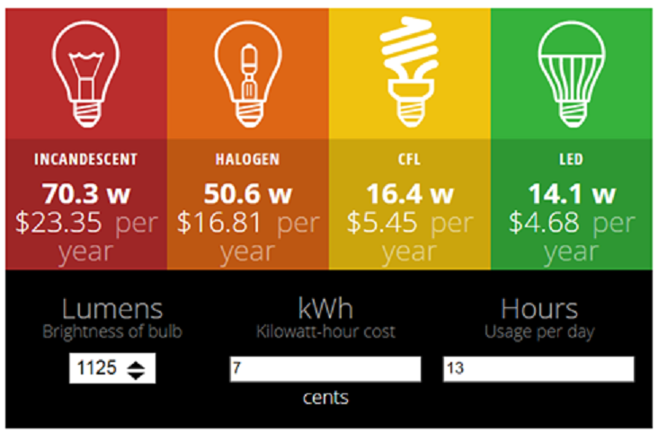

# CalcLite
An Angular2 app that will calculate the cost per year of different types of lightbulbs based on their wattage and verage usage. This app will aid in being more energy efficien,t and knowing the true cost of different types of bulbs.

## How it works!

